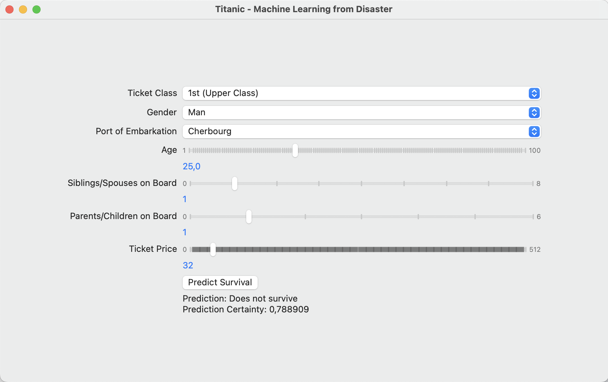

# Titanic Survival

A SwiftUI application that predicts the survival likelihood of a passenger on the Titanic ship

## Motivation

Learning how to utilize a [CoreML](https://developer.apple.com/documentation/coreml) model in a SwiftUI application to perform on-device machine learning

## Description

ML model trained on the data set from [Titanic - Machine Learning from Disaster](https://www.kaggle.com/competitions/titanic). 

Swift Playground for training the model can be found here [https://github.com/charlieroth/TitanicML](https://github.com/charlieroth/TitanicML)

## Application

